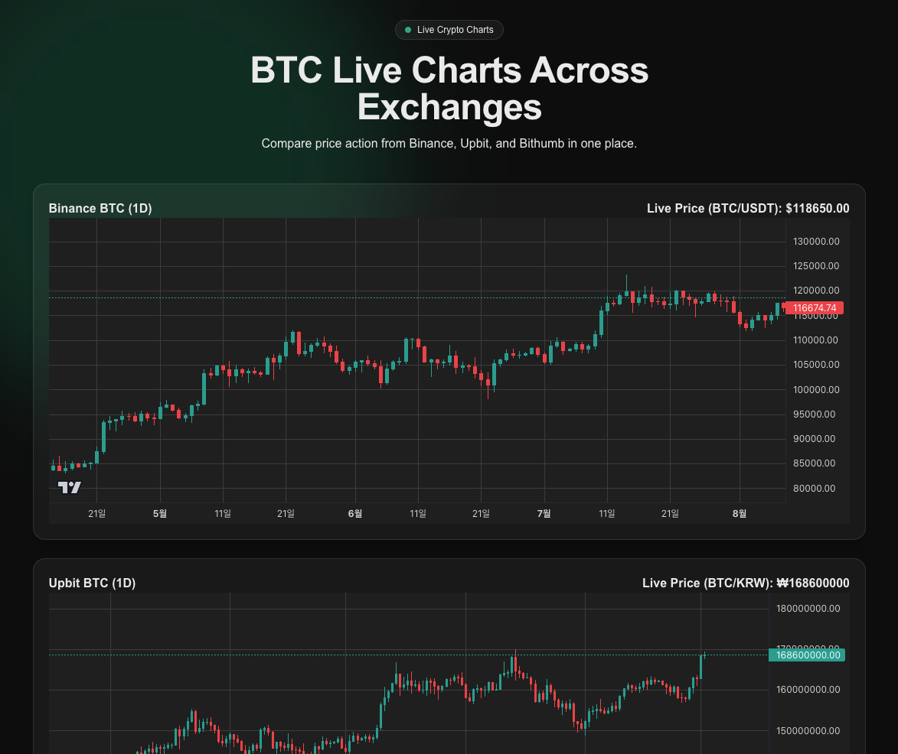

Price-to-Chart — Live BTC Charts Across Exchanges
================================================

Live candlestick charts for BTC aggregated from multiple exchanges (Binance, Upbit, Bithumb) using Lightweight Charts and WebSocket streams. Built with Next.js App Router and Tailwind CSS.

Screenshots


Key Features
- Real‑time price updates via WebSockets (Binance, Upbit, Bithumb)
- Serverless API routes proxy daily candles for KRW markets (avoid CORS)
- Responsive, card‑based layout with dark‑friendly styling
- Lightweight Charts for smooth, high‑performance rendering

Tech Stack
- Next.js 14 (App Router)
- React 18
- Tailwind CSS
- TradingView Lightweight Charts

Getting Started
1) Install dependencies
```bash
npm install
```
2) Run the development server
```bash
npm run dev
```
3) Open the app
Visit http://localhost:3000

Project Structure
- `app/page.tsx`: Landing page that renders three exchange cards
- `components/BinancePriceWssChart.tsx`: BTC/USDT chart with Binance REST (history) + WS (live)
- `components/UpbitPriceWssChart.tsx`: BTC/KRW chart using internal API + Upbit WS
- `components/BithumbPriceWssChart.tsx`: BTC/KRW chart using internal API + Bithumb WS
- `app/api/upbit-candles/route.ts`: Proxies Upbit daily candles (KRW-BTC)
- `app/api/bithumb-candles/route.ts`: Proxies Bithumb daily candles (KRW-BTC)
- `utils/websoket.ts`: Small helpers to open Upbit/Bithumb WS connections
- `app/globals.css`, `tailwind.config.ts`: Global styles and Tailwind config

How It Works
- Historical candles:
  - Binance: Fetched directly from Binance REST in the browser for BTC/USDT.
  - Upbit/Bithumb: Fetched via Next.js API routes to avoid CORS and ensure no-store caching.
- Live updates:
  - Exchange WebSockets stream ticker/candlestick updates; charts update with `series.update(...)`.
- Responsiveness:
  - The page arranges charts in a 1→2→3 column grid and resizes charts on window changes.

Available Scripts
- `npm run dev`: Start dev server
- `npm run build`: Build for production
- `npm run start`: Run production build
- `npm run lint`: Lint using Next.js ESLint config

Notes / Limitations
- Public APIs are used; rate limits may apply per exchange.
- Timeframes: examples here use daily candles; adjust endpoints/intervals as needed.
- KRW formatting is kept simple in UI; customize number formatting to your locale if required.

Customization Tips
- To change symbols or intervals, update REST endpoints and WS subscriptions in:
  - `components/BinancePriceWssChart.tsx`
  - `components/UpbitPriceWssChart.tsx`
  - `components/BithumbPriceWssChart.tsx`
- To modify layout/theme, tweak Tailwind classes in `app/page.tsx` and global styles.

Security / CORS
- Upbit and Bithumb candles are proxied through Next.js API routes to avoid client‑side CORS issues and disable caching (`no-store`). WebSocket connections are made directly from the client.

License
- This project is for educational/demo purposes. Review and comply with each exchange’s API Terms before production use.
